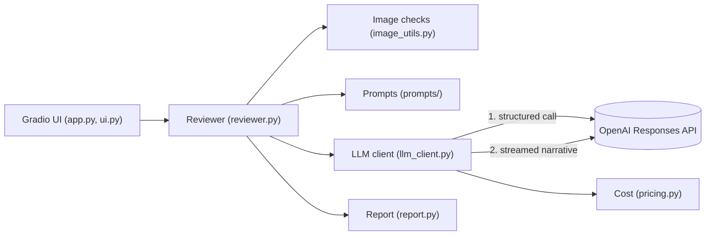

# Cloud Architecture Reviewer

AI reviewer for AWS architecture diagrams. Upload a diagram and get a Well-Architected scorecard, prioritised risks and suggested fixes, powered by OpenAI vision and a Gradio UI.


> **Status: v0.1.** The app works end to end and is tested with a fake client. CI, linting and type checks, a model comparison, Docker and a hosted demo are still to come. See the [roadmap](#roadmap).

## What it does

- Reads an architecture diagram (PNG, JPEG or WebP, up to 5 MB) and an optional description.
- Scores the six AWS Well-Architected pillars from 1 to 5 and lists risks with a severity and a concrete fix.
- Streams a written review while you watch.
- Lists what it could not confirm from the diagram instead of guessing.
- Shows tokens, latency and cost for every call, and lets you download the report as Markdown.

## How it works



A review is two model calls:

1. **Structured call.** The image, the prompts and the description go to the OpenAI Responses API with a Pydantic schema. The result is validated before anything is shown.
2. **Streamed call.** The validated findings go back as text only, with no image, and the written review streams into the UI.

If the second call fails, the scorecard and the usage already paid for are kept.

## Project structure

```text
cloud-arch-reviewer/
├── pyproject.toml, uv.lock, .env.example
├── scripts/smoke_test.py        # one real review from the command line
├── src/cloud_arch_reviewer/
│   ├── __init__.py              # entry point
│   ├── app.py                   # Gradio layout and launch
│   ├── ui.py                    # handler: throttled streaming, safe errors
│   ├── reviewer.py              # core logic, no UI imports
│   ├── llm_client.py            # the only module that imports the OpenAI SDK
│   ├── image_utils.py           # type, size and content checks
│   ├── pricing.py               # cost from token usage
│   ├── report.py                # Markdown report and scorecard rows
│   ├── schemas.py               # Pydantic models for the review
│   ├── config.py                # typed settings from .env
│   ├── logging_setup.py
│   └── prompts/                 # system prompt, pillars, examples, narrative
└── tests/
```

## Setup

You need [uv](https://docs.astral.sh/uv/), Python 3.12 (uv installs it for you) and an OpenAI API key.

```bash
git clone https://github.com/sivahere4cloud/cloud-arch-reviewer.git
cd cloud-arch-reviewer
uv sync
cp .env.example .env        # Windows PowerShell: Copy-Item .env.example .env
```

Open `.env` and set `OPENAI_API_KEY`. Never commit this file: it is in `.gitignore`.

```bash
uv run cloud-arch-reviewer
```

Open the local address printed in the terminal, usually http://127.0.0.1:7860.

## Configuration

All settings come from `.env` or environment variables.

| Variable | Default | Purpose |
|---|---|---|
| `OPENAI_API_KEY` | none, required | Your OpenAI key |
| `OPENAI_MODEL` | `gpt-6-luna` | Model used for both calls |
| `OPENAI_REASONING_EFFORT` | `low` | Reasoning effort sent to the API |
| `MAX_OUTPUT_TOKENS` | `25000` | Ceiling per call, including reasoning tokens |
| `REQUEST_TIMEOUT_SECONDS` | `60` | Timeout per request |
| `MAX_RETRIES` | `3` | Retries for transient errors, handled by the OpenAI SDK |
| `MAX_IMAGE_MB` | `5` | Largest accepted upload |
| `LOG_LEVEL` | `INFO` | Logging level |

Costs are only calculated for models listed in `pricing.py` (`gpt-6-luna` and `gpt-6.1-sol`). For any other model the review still works and the cost shows as unavailable.

## Tests

```bash
uv run pytest
```

Nine tests run in about three seconds, offline, with a fake client in place of OpenAI. They cover the full happy path, a failed written review that keeps the scorecard, rejected input that never reaches the API, safe error messages in the UI, and building the app.

## Design decisions

- **One module talks to OpenAI.** Everything else depends on a small interface, so tests swap in a fake client.
- **Typed output.** The review is validated by Pydantic schemas. The 1 to 5 score range is enforced in Python, because strict structured output supports only a subset of JSON Schema.
- **Honest about gaps.** The prompt tells the model to list anything it cannot read or confirm in `unclear_items`, and never to claim it verified encryption, IAM or traffic.
- **SDK retries, not custom ones.** Retries and timeouts use the OpenAI SDK's built-in behaviour, configured from settings.
- **Cost includes cache writes.** The cost is calculated from reported usage, including cached and cache-write tokens. An unknown model gives "cost unavailable" and does not discard a paid review.
- **Safe errors.** Known problems show a clear message. Unexpected errors are logged with a traceback, and the user sees only a generic message.
- **Basic protection.** At most 2 reviews run at once and 10 wait in the queue.
- **Pinned dependencies.** `uv.lock` pins the exact versions (Gradio 6.29.1, OpenAI SDK 3.24.0 at the time of writing). Both libraries changed behaviour compared with older tutorials.
- **Secrets.** `.env` is ignored, `.env.example` holds placeholders only, and GitHub push protection is on.

## Observations

Five runs on one sample diagram (an AWS Fault Injection Service test setup) with `gpt-6-luna` and reasoning effort `low`:

| Measure | Observed |
|---|---|
| Average score | 2.7 in four runs, 2.8 in one |
| Risks reported | 4 to 5 |
| Cost per review, both calls | $0.0011 to $0.0015 |
| Time per review | about 23 to 25 seconds |

This is an observation, not a benchmark. The evaluation on the roadmap will compare models and effort levels on several diagrams.

## Limitations

- Vision models can misread dense or low-resolution diagrams.
- A diagram that does not show monitoring is not proof there is none. The reviewer is told to list such items as unconfirmed, but it can still rate them as risks.
- Scores and findings vary slightly between runs.
- The image and description are sent to OpenAI. Do not upload confidential diagrams.
- There is no login, so the app is for local use only. Report files are written to the system temp folder and are not cleaned up yet.

## Roadmap

- [ ] Linting and type checks (ruff, mypy) and tests for the remaining modules
- [ ] GitHub Actions: lint, types and tests on every push
- [ ] Evaluation: compare models and reasoning effort on several diagrams, with a faithfulness check on the written review
- [ ] Dockerfile and docker-compose
- [ ] Hosted demo on AWS EC2, with authentication and a spend cap first
